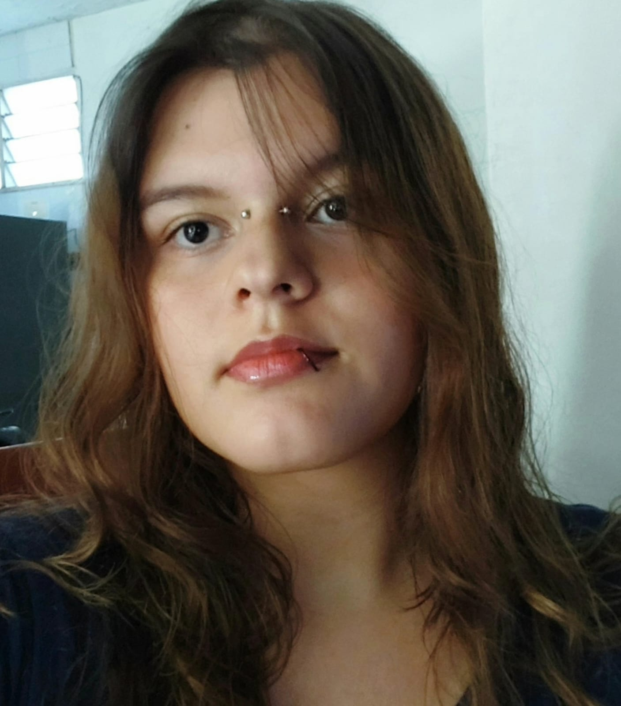

# -Reconocimiento-del-entorno-y-armado-de-equipos-con-SCV
Repositorio del curso Programación para Videojuegos  Etapa 1: Reconocimiento del entorno y armado de equipos con SCV. Incluye presentaciones individuales, organización de equipo y uso de control de versiones GitHub
## María Camila Bolívar Betancourt

 | 

*Mi foto personal*  *Mis galletas favoritas: de mantequilla con decorado rosa en forma de corazón*

**Rol en la industria:** Artista 2D/3D  
**Ubicación:** Tuluá, Colombia  

**Perfil breve:**  
Estudiante de Ingeniería Multimedia apasionada por el arte digital. Me especializo en el diseño de personajes, escenarios y assets 2D para videojuegos. Manejo herramientas como Krita para ilustración, Blender para modelado 3D y Synfig Studio para animación.
